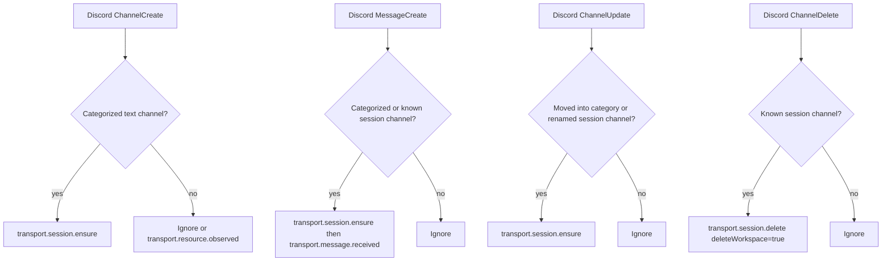

# Discord Transport Intent Migration

## Why This Exists

The Discord UX should not be built around Moorline-managed coordination, status, sessions, and archive channels. Discord should be a simple server-native surface:

- user-created categories visually group work,
- new categorized text channels become sessions,
- orphan text channels are ignored,
- `moorline-start` explains how to use the server,
- `/status` is the only normal command,
- archive is not a visible Discord workflow.

Moorline 0.0.3 uses a transport intent/effect contract so Discord can interpret native Discord events and let Moorline core own durable consequences.

## Discord Work

`rync/discord` implements `onIntent` and `applyEffect` instead of relying on the old fixed managed surface.

### Native Event Mapping

### Setup

Discord setup should create or repair only:

- `moorline-start`

It should not create:

- Moorline main category,
- coordination channel,
- status channel,
- sessions category,
- archive category.

`moorline-start` should be an orphan channel with an embedded intro message. Normal messages there should be ignored.

### Runtime Plugin

`rync/discord-runtime` no longer includes:

- admin controls,
- session create/archive/delete/list commands,
- archive/delete resource commands,
- request answer/cancel commands,
- verbose provider/projection diagnostics from normal status.

Keep:

- `/status`

Later, if needed:

- add `/wake`, but prefer host-level auto-resume on message first.

## Current Decisions

- Existing categorized channels on startup are remembered for classification but are not bulk-created as sessions.
- New categorized text channels become sessions.
- Moving a text channel into a category also ensures a session.
- A user message in a categorized channel ensures the session before routing the message, which repairs missed channel-create events while the bot was offline.
- Deleting a session channel deletes the session workspace.
- Archived Discord sessions wake automatically when the user sends a message for the same transport resource.

## Important Boundary

Discord transport interprets native Discord state. Moorline core validates and performs durable state changes.

Discord should emit:

- `transport.session.ensure`
- `transport.session.delete`
- `transport.message.received`
- `transport.action.invoked`

Moorline core should emit effects:

- `transport.message.send`
- `transport.actions.register`
- optional resource effects only when Discord actually wants native changes.
